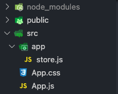
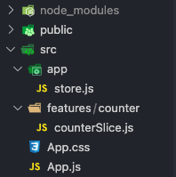
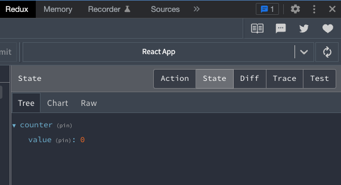
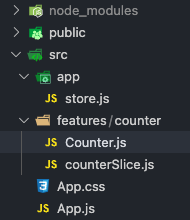
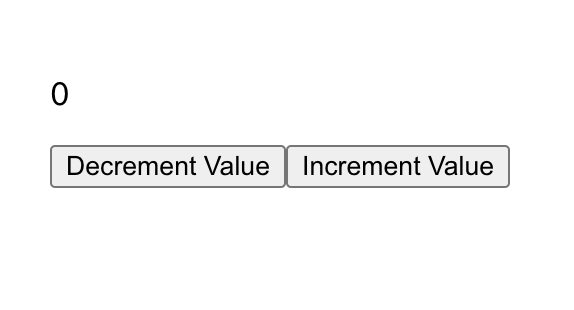
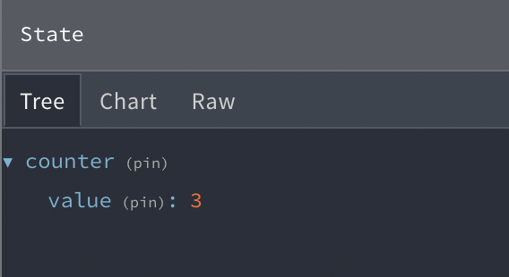
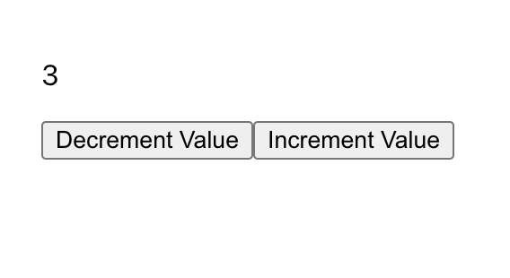

# Redux/ Redux Toolkit

[Redux Documents](https://redux.js.org/) | [Redux Toolkit Documents](https://redux-toolkit.js.org/)
<br />
<br />

## What is Redux and Redux Toolkit?  

Redux is a package that gives us the ability to store pieces of state globaly. This can be helpful to allow the programmer to avoid prop drilling and lifting state.  Depending on your app you may still consider using the `{ useState }` hook for local pieces of state in addition to this new functionality.  

Redux Toolkit is a package that helps simplify the Redux logic.  It is the prefered method for using Redux.  

> <i>Redux Toolkit is our official recommended approach for writing Redux logic. It wraps around the Redux core, and contains packages and functions that we think are essential for building a Redux app. Redux Toolkit builds in our suggested best practices, simplifies most Redux tasks, prevents common mistakes, and makes it easier to write Redux applications.</i> -[from the docs](https://redux.js.org/introduction/getting-started#redux-toolkit)

### <u>When to use Redux?</u>

You may consider using Redux if:
- Many pieces of state are needed in various components throughout the app
- Logic to update the state is overly complex
<br />
<br />

## Redux in a Nutshell

I think of Redux as deconstructing the different elements of `useState` so that we can place that piece of state into the global store. It does so by breaking it in to the following five basic components:

><h3><u>State</u></h3> These are the variables that we manipulate in order to run our app. <br /><br />

><h3><u>Store</u></h3> This is where the global state resides. <br /><br />

><h3><u>Actions</u></h3> Actions are essentially an object that describes the "where" and the "what" that will take place.  Since we can have many pieces of state in the store it will contain a name that describes the domain it shall take place (where).  It will also contain a payload (what). <br /><br />

><h3><u>Reducers</u></h3> Reducers take the current state from the store and the action and then updates the state in the store based on the written logic. <br /><br />

><h3><u>Dispatchers</u></h3> These are methods attached to the store.  When we run a dispatcher we also pass it an action object.  This will trigger the cooresponding reducer which will update the store. <br /><br />

<hr />


[Redux Flow](https://redux.js.org/tutorials/essentials/part-1-overview-concepts#redux-application-data-flow)

<hr />
<br />
<br />

# Redux Toolkit Counter

In this lesson we will be learning how to set up Redux Toolkit and implement a store within a React app.  For learning purposes we will be following the [Redux Toolkit Quick Start](https://redux-toolkit.js.org/tutorials/quick-start) to build a counter from the ground up so that each step is understood.  
> There is a Redux Toolkit template that can be downloaded as some of this set up can be fairly tedious and boilerplate.  The terminal command for this is in the Redux Toolkit Docs and it will also be shared at the [bottom](#create-react-app--redux-template) of the this markdown.

Redux has it's own set of dev tools, make sure to install them to your browser so you can access their features. 

[Chrome Extension](https://chrome.google.com/webstore/detail/redux-devtools/lmhkpmbekcpmknklioeibfkpmmfibljd?hl=en) | [Firefox Extension](https://addons.mozilla.org/en-US/firefox/addon/reduxdevtools/) 

<br />
<br />

## Create React App 

Navigate to a directory to initilize a React app, call it something like `redux-toolkit-counter` 

In the terminal run: 
```
npx create-react-app redux-toolkit-counter
```
## Install the Redux and Redux Toolkit Packages

CD into the `redux-toolkit-counter` directory and in the terminal run: 
```
npm i @reduxjs/toolkit react-redux
```

## Create the Store

This is where we will keep the global state for our app.

Create a folder inside the `src` directory named `app`
Create a new file inside `app` and name it `store.js`



### Configure the Store

Import the `{ configureStore }` hook from `"@reduxjs/toolkit"` and export the store.  The `configureStore` hook holds an object that contains all of our reducers, we are going to put an empty reducer object in there for now that we will fill with our reducers once they are set up. 

```javascript
import { configureStore } from "@reduxjs/toolkit"

export const store = configureStore({
    reducer: {

    }
})
```
<i>store.js</i>
<hr />

## Provide the Store

Open `index.js` we are going to add some code to this file in order to make our store acesable to the app. We need to: 
1) Import the `{ store }` we just created. We wil also import the `{ Provider }` hook from `react-redux`.
2) Wrap the `<App />` with `<Provider>` and pass our `store` in as a prop.  It should look something like this:

```javascript
import React from 'react'
import ReactDOM from 'react-dom/client'
import './index.css'
import App from './App'
import reportWebVitals from './reportWebVitals'
import { store } from './app/store'     // 1. Add this line 
import { Provider } from 'react-redux'  // 1. Add this line 

const root = ReactDOM.createRoot(document.getElementById('root'))
root.render(
  <React.StrictMode>
    <Provider store={store}>           {/* 2. Add this line */}
      <App />
    </Provider>                        {/* 2. Add this line */}
  </React.StrictMode>
)
```
<i>index.js</i>
<hr />

## Create the Counter Slice

A slice is where all of the action and reducer logic resides for each of the features in our app.  Since we are building a counter feature we will make a counter slice.  Each feature should have its own slice. For example: if our app had a post feature and a delete feature, we would make a seperate slice for each. 

In the `src` directory create another directory called `features` and within `features` create another directory called `counter`.  Create a new file named `counterSlice.js` with in this folder.



Within `counterSlice.js` we will define the increment and decrement logic for our counter.  
1) Import the `{ createSlice }` hook. 
2) Create the initial state of the counter within our store.
3) Using the `counterSlice` hook, create the slice object, we will put in a  name, the `initialState` we just created and each `reducer` object.
4) Create the action logic for the increment and the decrement within the reducer object.  Each will be anonymous functions that use state as a parameter. We can write logic that mutates the state because Redux uses a library called [immer](https://immerjs.github.io/immer/) 
5) Export both actions seperately and the reducer itself.  The dispatcher will need to use the actions and the store will need to use the reducer. 

```javascript
// Step 1.
import { createSlice } from '@reduxjs/toolkit'   

 // Step 2.
const initialState = {                          
  value: 0,
}

// Step 3.
export const counterSlice = createSlice({       
  name: 'counter',
  initialState,
  reducers: {
    //Step 4.
    increment: (state) => {
      state.value += 1
    },
    decrement: (state) => {
      state.value -= 1
    },
  },
})

// Step 5.
export const { increment, decrement } = counterSlice.actions

export default counterSlice.reducer
```
<i>counterSlice.js</i>
<hr />

## Add the Reducer to the Store

Within `store.js`
1) Import `counterReducer` 
2) Add it to the reducer object we created earlier.

```javascript
import { configureStore } from "@reduxjs/toolkit"
import counterReducer from '../features/counter/counterSlice'  // 1. Add this line 

export const store = configureStore({
    reducer: {
        counter: counterReducer,  // 2. Add this line 
    }
})
```
<i>store.js</i>
<hr />

Once this is done we should be able to see the `value` state in our store using the redux dev tools in the browser.

In the terminal run:
```
npm start
```

Once the React app is running in the browser open the Redux dev tools.  If you cannot locate the Redux dev tools, they may be in the drop down menu (press the >> button)



## Create the Counter Component

Within the `/features/counter` directory create a file named `Counter.js`.  



This is where we will:
1) Import and use the `{ useDispatch }` hook in order to put our dispatchers to work.  
2) Import and use the `{ useSelector }` hook to grab the current state of `value` from within the store and set it to `value` within the counter component.
3) Import the `increment` and `decrement` actions we made in the `counterSlice` so they can be implemented by `dispatch()`.
4) Create the user interface for counter. We will call the dispatchers using an anonymous function in the `onClick` of the `<button>`.

```javascript
import { useSelector, useDispatch } from "react-redux" // Step 1.
import { increment, decrement } from "./counterSlice"  // Step 3.

const Counter = () => {
    // Step 1.
    const value = useSelector((state) => state.counter.value) 
    // Step 1.
    const dispatch = useDispatch()

    return (
        <>
            <div>
                <p>{value}</p>
                {/* step 3. and 4. */}
                <button onClick={() => dispatch(increment())}>Increment Value</button>
                <button onClick={() => dispatch(decrement())}>Decrement Value</button>
            </div>
        </>
    )
}

export default Counter
```
<i>Counter.js</i>
<hr />

## Counter Component Inside App.js

Inside the `App.js` file import the `Counter.js` component.  Remove all of the pre-populated code within the return and and replace it with the JSX `<Counter />` element. 

```javascript
import './App.css'
import Counter from './features/counter/Counter'

function App() {
  return (
    <Counter />
  );
}

export default App;
```
<i>App.js</i>
<hr />
<br />

Our user interface is going to be very basic but it would be nice to at least move it away from the edge of the page.  in the `App.css` file remove all of the code and replace it with:

```css
body {
  padding: 2em;
}
```
<i>App.css</i>
<hr />


If we run our code we will have the following rendered to the browser window:



If we press the increment button a few times the `value` will be updated in both the store and the browser window.  

Make sure to test the decrement button as well!





<hr />
<br />

We have just finished setting up the store, actions, reducers and dispatchers in order to make the piece of state `value` available to our React app globaly.  Thanks, Redux and Redux Toolkit!

<br />
<br />
<br />

## Create React App + Redux Template

Once you become comfortable with the set up of Redux and Redux Toolkit you may find that some of it becomes repetetive.  When first creating a react app this terminal command can be used.  All of the set up for the store that we just went through will be done for us already. This template also includes some other examples built in if you like to reverse engineer! 
```
npx create-react-app <my-app> --template redux
```